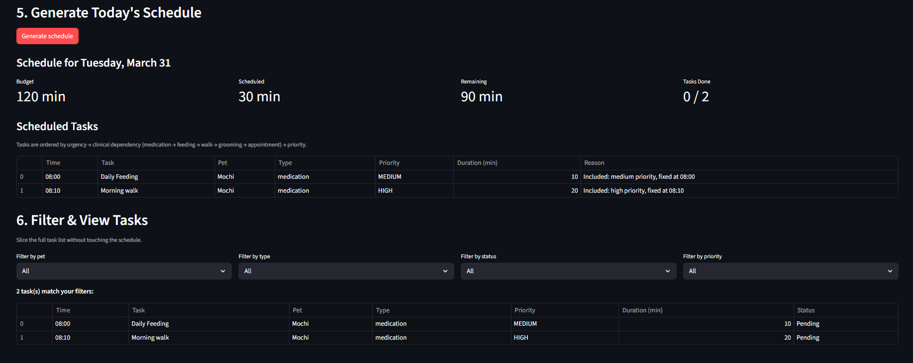

# PawPal+

**PawPal+** is a Streamlit app that helps busy pet owners plan and track daily care tasks across multiple pets. It takes your available time, your pets' needs, and your scheduling preferences, then generates a prioritized daily plan — complete with conflict warnings, urgency boosts for health-critical tasks, and recurring reminders that never need to be re-entered.

---

## Features

### Scheduling

| Feature | Description |
|---|---|
| **Priority-based scheduling** | Tasks are ranked high → medium → low. The scheduler always fits the most important tasks first within your available time budget. |
| **Urgency boost** | If a pet has a special need (e.g. `insulin injection`, `arthritis`) that matches a task's type, that task receives a priority boost and floats to the top — even above other high-priority tasks. |
| **Clinical dependency ordering** | Flexible tasks are reordered so that medication always comes before feeding, feeding before walks, walks before grooming, and grooming before appointments. This mirrors real veterinary care sequencing. |
| **Fixed-time tasks** | Tasks with a specific scheduled time (e.g. `08:00`) are always included in the plan and locked to that slot. |
| **Configurable day start and buffer** | You choose when your day starts (e.g. `07:30`) and how many minutes of breathing room to leave between tasks. Flexible tasks are spread out accordingly. |
| **Overload warning** | If the total requested task time exceeds your budget, the app warns you before generating the plan — telling you exactly how many minutes over you are and which tasks will be skipped. |

### Conflict Detection

| Feature | Description |
|---|---|
| **Time-overlap detection** | The scheduler scans all fixed-time tasks for wall-clock overlaps using pairwise interval comparison. If two tasks share a time window, a clear error banner appears at the top of the schedule. |
| **Non-crashing warnings** | Conflicts are reported as human-readable messages — the app never crashes. You see the warning and the full schedule together so you can decide what to reschedule. |

### Recurring Tasks

| Feature | Description |
|---|---|
| **Daily recurrence** | A task marked `daily` appears in every day's plan automatically. |
| **Weekly recurrence** | Fires on specified days of the week (e.g. Mon, Wed, Fri). |
| **Bi-weekly recurrence** | Fires every 14 days from a chosen start date using day-delta arithmetic. |
| **Every-N-days recurrence** | Fires every custom number of days from a start date (e.g. flea treatment every 30 days). |
| **Auto-spawn on completion** | When you mark a recurring task complete, the next occurrence is automatically added to your pet's task list with the correct due date calculated via Python's `timedelta`. |

### Filtering & Viewing

| Feature | Description |
|---|---|
| **Filter by pet** | See only the tasks that belong to a specific pet. |
| **Filter by task type** | View only medication, feeding, walk, grooming, appointment, or other tasks. |
| **Filter by status** | Separate completed tasks from pending ones. |
| **Filter by priority** | Show only high, medium, or low priority tasks. |
| **Sort by time** | All filtered results are sorted chronologically by scheduled time. Tasks with no fixed time appear at the end. |

---

## 📸 Demo



---

## Setup

```bash
# 1. Clone or download the project
# 2. Create and activate a virtual environment
python -m venv .venv
source .venv/bin/activate        # Windows: .venv\Scripts\activate

# 3. Install dependencies
pip install -r requirements.txt

# 4. Launch the app
streamlit run app.py
```

---

## Usage

The app is divided into six sections that you work through top to bottom:

**1. Owner Setup**
Enter your name, how many minutes you have available today, what time your day starts, and how much buffer to leave between tasks.

**2. Add a Pet**
Enter each pet's name, species, age, breed, and any special care needs (comma-separated). Special needs drive the urgency boost — for example, entering `insulin injection` causes that pet's medication tasks to be treated as health-critical.

**3. Add Tasks**
Add one-off care tasks (walks, feedings, medications, grooming, appointments). Set a fixed time to lock a task to a specific slot, or leave it blank to let the scheduler place it automatically.

**3.5 Add Recurring Tasks**
Add task templates that repeat on a schedule. Choose from daily, weekly, bi-weekly, or every-N-days frequency. These generate fresh task instances each day without needing to be re-entered.

**4. Scheduling Preferences**
Optionally tell the scheduler when you prefer certain task types — for example, "prefer walks in the morning."

**5. Generate Today's Schedule**
Click **Generate schedule**. The app runs the full scheduling pipeline and displays:
- An overload warning if total task time exceeds your budget
- Conflict errors for any overlapping fixed-time tasks
- Budget metrics (scheduled, remaining, tasks done)
- A sortable table of scheduled tasks with the reasoning behind each placement
- A table of skipped tasks and why they were dropped

**6. Filter & View Tasks**
Use the four dropdown filters to slice the full task list by pet, type, status, and priority. Results are sorted by scheduled time automatically.

---

## Running the Tests

```bash
python -m pytest tests/test_pawpal.py -v
```

All 67 tests complete in under a second. The `-v` flag prints each test name.

### Test coverage

| Section | Tests | What is verified |
|---|---|---|
| Schedule Generation | 9 | Empty plans, budget fitting, fixed tasks always scheduled, overload warning, urgency boost ordering, clinical dependency order, reasoning recorded for every task |
| Recurring Task Activation | 14 | All 4 frequency modes, correct day-on/day-off behaviour, biweekly arithmetic, future start-date guard, `Pet.get_tasks_today` integration |
| Conflict Detection | 8 | True overlaps flagged, back-to-back tasks not flagged, zero/single fixed-task edge cases, partial overlaps, 3-way conflict pairs |
| Task Completion & Recurrence | 6 | Daily task creates next-day task, weekly creates next-week task, one-off spawns nothing, invalid ID returns `None` |
| Sorting & Time-Slot Assignment | 8 | Chronological sort, single flexible task placed at `day_start`, flexible task moved past fixed slot, while-changed loop correctness, buffer gap |
| Urgency Scoring | 6 | Keyword match gives +2, no match gives 0, `None` pet, case-insensitivity, partial substring match |
| Task Filters | 6 | Filter by pet, type, completed status, pending status, high priority, low priority |
| DailyPlan Utilities | 7 | Time remaining, `all_done` states, `get_reason` for known and unknown IDs, `completion_count` |

**Confidence: 4 / 5** — the core scheduling pipeline is fully tested with deterministic inputs. One star is held back because the Streamlit UI and session-state persistence are not covered by automated tests.

---

## Project Structure

```
PawPal+/
├── app.py               # Streamlit user interface
├── pawpal_system.py     # All scheduling logic and data classes
├── main.py              # CLI demo (8 demos, no UI required)
├── generate_uml.py      # Generates uml_final.png from the Mermaid diagram
├── uml_final.mmd        # Mermaid source for the UML class diagram
├── uml_final.png        # Final UML class diagram (exported image)
├── reflection.md        # System design reflection and UML
├── requirements.txt     # Python dependencies
├── tests/
│   └── test_pawpal.py   # 67-test pytest suite
└── docs/
    └── app_screenshot.png   # Add your own screenshot here
```

---

## Architecture Overview

PawPal+ uses a three-layer design:

- **Data layer** — `Pet`, `Task`, `RecurringTask`, `Preference` hold state. Each pet owns its own task lists so ownership is structurally enforced.
- **Coordination layer** — `Owner` aggregates pets and preferences. `DailyPlan` is the output artifact: it holds the scheduled tasks, skipped tasks, conflict messages, overload warning, and per-task reasoning strings.
- **Logic layer** — `Scheduler` runs the full scheduling pipeline (collect → overload check → conflict detection → urgency sort → dependency order → preference application → greedy fit → time assignment). `TaskFilter` is a stateless utility class for slicing task lists without touching the UI.

The scheduler uses a **greedy first-fit algorithm**: it always includes fixed-time tasks, then fills the remaining budget by walking the priority-sorted flexible task list and adding each task if it fits. It never backtracks. This is a deliberate tradeoff — a perfect fit would require solving the NP-hard 0/1 knapsack problem, which is overkill for a list of 8–12 daily pet care tasks.
