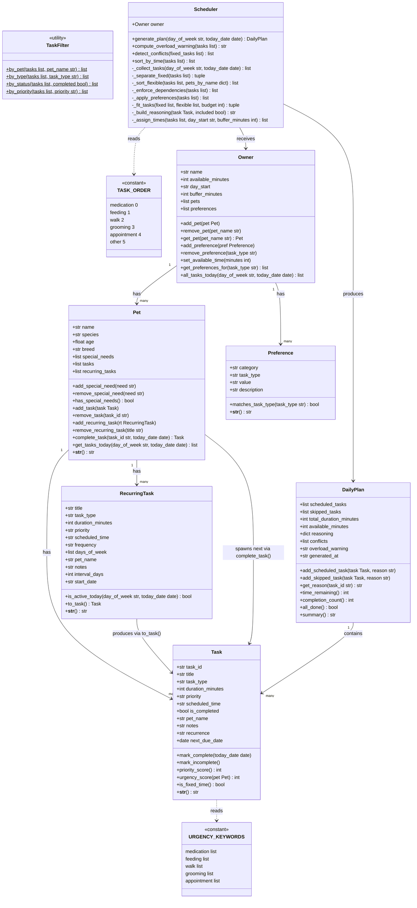

# PawPal+ Project Reflection

## 1. System Design

**a. Initial design**

The system is designed around seven classes divided into three layers: data objects that hold state, a coordinator object that organizes them, and an engine that runs the scheduling logic.

- **Pet** — holds all information about one animal (name, species, age, breed, special needs) and owns that pet's task lists (one-off tasks and recurring task templates). Task management methods (`add_task`, `remove_task`, `get_tasks_today`) live here so that each pet is fully self-contained.
- **Task** — represents a single care action for today (walk, feeding, medication, grooming, appointment). It carries everything the scheduler needs: duration, priority, an optional fixed time, and a completion flag so the owner can check tasks off during the day.
- **RecurringTask** — a reusable template for tasks that repeat daily or weekly (e.g., daily 7 AM feeding). It never gets checked off itself; instead it generates a fresh Task instance each day via `to_task()`, keeping the template clean.
- **Preference** — encodes one scheduling constraint from the owner (e.g., "prefer walks in the morning", "medications at a fixed time"). Storing these as objects rather than strings lets the Scheduler query them by task type programmatically.
- **Owner** — manages a list of pets and the owner's preferences and available time. It no longer holds tasks directly; instead `all_tasks_today` iterates through all pets and collects their tasks in one place for the Scheduler.
- **DailyPlan** — the output artifact produced by the Scheduler. It stores the ordered list of tasks that fit in today's time budget, the tasks that were skipped, and a reasoning string for each task so the UI can explain the plan to the owner.
- **Scheduler** — the algorithmic engine. It takes an Owner, separates fixed-time tasks from flexible ones, sorts flexible tasks by priority, greedily fills the time budget, assigns suggested start times, and returns a DailyPlan. All business logic lives here so it can be tested independently of the UI.

**Core User Actions**

The core actions a user should be able to perform are:

1. **Add a pet** — The user can enter basic information about their pet (name, species, age, and any special needs). This gives the scheduler the context it needs to tailor task recommendations to that specific animal.

2. **Add and manage care tasks** — The user can create tasks such as morning walks, feedings, medication doses, grooming sessions, or vet appointments. Each task includes a title, estimated duration, and a priority level (low, medium, or high) so the scheduler knows what to fit in first.

3. **Set available time and preferences** — Before generating a plan, the user tells the app how much free time they have today (e.g., 90 minutes) and any personal preferences (e.g., prefer walks in the morning, medications must happen at a fixed time). This acts as the main constraint the scheduler works within.

4. **Generate and view the daily schedule** — The user can request a prioritized daily plan. The app orders tasks by priority and fits them within the available time window, then displays the schedule clearly along with a short explanation of why each task was included and when it should happen.

5. **Mark tasks as completed** — Throughout the day, the user can check off tasks as they finish them. This lets the app track what still needs to be done and could be used in future sessions to surface recurring tasks that are often skipped.

6. **Add a recurring appointment** — The user can schedule standing appointments (e.g., weekly vet checkup, daily 7 AM feeding) that automatically appear in the plan every day or on a set schedule, so the user does not have to re-enter them manually.

**UML Class Diagram**

**b. Design changes**

Two bottlenecks were found when reviewing the class skeleton before implementing any logic:

1. **`Task.task_id` was initialized to `None`.**
   In the original skeleton, `task_id` was a placeholder comment ("auto-generated in implementation"). The problem is that `Owner.remove_task`, `DailyPlan.get_reason`, and the `reasoning` dictionary all use `task_id` as a key. If every task has `task_id = None`, these lookups either silently overwrite each other or always fail to find the right task. The fix was to import `uuid` and generate a unique ID immediately in `Task.__init__` with `str(uuid.uuid4())`, so every Task has a guaranteed unique ID from the moment it is created.

2. **`DailyPlan.generated_at` was initialized to `None`.**
   The original comment said "set in implementation," but there is no separate method that sets it — it is only ever written once, when the plan is first created. Deferring it to "later" means it could easily be forgotten and stay `None` permanently. The fix was to set it immediately in `DailyPlan.__init__` using `datetime.now().strftime("%Y-%m-%d %H:%M")`, so the timestamp is always present as soon as a plan is instantiated.

3. **Tasks and recurring tasks moved from `Owner` to `Pet`.**
   The original UML placed `tasks` and `recurring_tasks` as lists on `Owner`, with `Owner` responsible for adding, removing, and serving them. During implementation it became clear that a task always belongs to a specific pet — a walk is Mochi's walk, a medication is Bella's medication. Keeping tasks on Owner meant the pet association was only tracked through a `pet_name` string field, with no structural enforcement. Moving the lists to Pet makes each pet fully self-contained: `pet.add_task()`, `pet.remove_task()`, and `pet.get_tasks_today()` all live where the data lives. Owner's `all_tasks_today` now simply iterates through its pets and collects their tasks, which is a cleaner separation of responsibility.

---

## 2. Scheduling Logic and Tradeoffs

**a. Constraints and priorities**

The scheduler considers three types of constraints, layered in a deliberate order.

The first and most important constraint is **time**. The owner tells the app how many minutes they have available today, and every scheduling decision flows from that number. Fixed-time tasks always get included regardless of the budget — if a dog needs insulin at 8 AM, that is non-negotiable. After fixed tasks are placed, the remaining minutes become the budget for everything else.

The second constraint is **priority**. Flexible tasks are sorted high → medium → low before being fitted into the remaining time. Within the same priority level, a second sort by urgency score runs first — if a pet has a health condition that matches a task's type (like a diabetic cat whose medication tasks get a +2 boost), those tasks float above everything else at the same priority level. Within the same priority and urgency, tasks are also ordered by clinical dependency: medication must come before feeding, feeding before walks, and so on.

The third constraint is **owner preferences**. If the owner says "I prefer walks in the morning," the scheduler pins morning tasks to an 08:00 time slot before running the greedy fit. Preferences are softer than the other two constraints — they shape the order, not whether a task fits.

I decided on this layering because time is truly the hard wall: no algorithm can create time that does not exist. Priority determines what gets cut when time runs short. Preferences are the final polish — they personalize the plan without overriding the more critical constraints.

**b. Tradeoffs**

The scheduler uses a **greedy first-fit algorithm**: it sorts tasks by priority and then adds each one to the plan if it fits in the remaining time budget, moving on immediately if it does not. It never backtracks or tries a different combination.

This creates a real tradeoff. Suppose 35 minutes remain in the budget and the next task (high priority) needs 40 minutes — it gets skipped. But two lower-priority tasks totaling 30 minutes could have filled that gap productively. The greedy approach misses this because it never looks ahead or reconsiders a rejected task.

The alternative — trying every possible combination of tasks to find the best fit — is a version of the **0/1 knapsack problem**, which is NP-hard. A brute-force solution checking all combinations would be exponentially slower as the number of tasks grows.

This tradeoff is reasonable for a pet care app for two reasons. First, a typical owner has at most 8–12 tasks per day, so the greedy result is close to optimal in practice — there are rarely enough tasks to expose the gap. Second, predictability matters more than perfection here: the owner can read the "Skipped" list and understand exactly why each task was dropped (not enough time, in priority order), which is more useful than an opaque optimal solution that is hard to explain.

---

## 3. AI Collaboration

**a. How I used AI**

I used VS Code Copilot as my AI agent throughout this project, and its role shifted depending on which phase I was in.

In the **design phase**, I used VS Code Copilot as a brainstorming partner. I described the scenario in plain English — "a pet owner needs to schedule care tasks across multiple pets within a time budget" — and asked it to help me think through what objects I needed. It helped me spot that a `Preference` object made more sense than a plain string, and that `DailyPlan` should be a separate output artifact rather than just a list. That conversation shaped the initial UML.

In the **implementation phase**, I used VS Code Copilot to write first drafts of methods after I had already decided what each method should do. I found the most effective pattern was to write the method signature and docstring myself, then ask Copilot to fill in the body. This kept me in control of the design while letting Copilot handle the mechanical parts of the code.

In the **algorithmic upgrade phase**, I described each algorithm in plain terms — for example, "check every pair of fixed-time tasks and flag any whose time windows overlap" — and asked VS Code Copilot as my AI agent to translate that into Python. The pairwise interval check `(a_start < b_end AND b_start < a_end)` came out of exactly that kind of back-and-forth.

In the **debugging phase**, I used VS Code Copilot most for error messages I did not immediately recognise. Pasting a traceback and asking "why would this happen?" consistently pointed me to the right file and line faster than reading docs.

The prompts that worked best were always specific and scoped. "Write a method that filters a list of Task objects by pet name" got a clean answer. "Help me with my scheduler" got something vague. The more precisely I described what I already knew I wanted, the more useful the output.

**b. Judgment and verification**

One clear moment where I did not accept a VS Code Copilot suggestion as-is was during the time-slot assignment logic. When I asked it to write `_assign_times()`, VS Code Copilot generated a version that used a single pass through the occupied time slots to check for conflicts with the cursor. At first glance it looked correct — it found an overlapping slot and moved the cursor past it. But I noticed that if two fixed-task blocks were adjacent, a single pass would only move the cursor past the first block and then stop checking, potentially landing the flexible task inside the second block.

I tested this by hand: if fixed tasks occupied 09:00–09:30 and 09:30–10:00, and the cursor landed at 09:35 after the first check, the single-pass version would not catch that 09:35 is still inside the second block. I replaced the single pass with a `while changed` loop that re-scans all occupied slots after every cursor move. This made the logic correct regardless of how many adjacent fixed slots existed.

I verified the fix by writing test cases specifically for adjacent fixed blocks and running them in pytest. Having tests meant I could change the implementation confidently and know immediately whether the fix held.

---

## 4. Testing and Verification

**a. What I tested**

I focused my tests on the behaviors that could silently produce a wrong answer without crashing — the kind of bugs that are hardest to catch by just clicking through the app.

The most important tests were for the **scheduling pipeline** itself: does an empty task list produce an empty plan? Does the scheduler correctly skip a task that is over budget? Does a fixed-time task always appear in the schedule even if it alone would exceed the budget? These tests matter because the scheduler is the core of the whole app — if it silently drops a task or places it at the wrong time, the owner gets a plan they cannot trust.

The second priority was **recurring task arithmetic**. Getting the date math right for biweekly and every-N-days recurrence is easy to get almost-right in a way that breaks on specific day combinations. I fixed a reference date (`2026-03-30`, a Monday) so that all date-based tests are deterministic — they give the same result every time regardless of when you run them.

**Conflict detection** needed its own tests because the off-by-one boundary is subtle: two tasks that are back-to-back but not overlapping (one ends at 09:30, the next starts at 09:30) should NOT be flagged as a conflict. A naive `<=` comparison instead of `<` would get this wrong.

**Urgency scoring** tests were important because the keyword matching is case-insensitive and substring-based — `"arthrit"` should match a pet whose special need is `"arthritis"`. Without tests it would be easy to break this with a small refactor.

**b. Confidence**

I am confident the core scheduling logic is correct. All 67 tests pass, they use fixed inputs so they are not random, and they cover the edge cases I can think of.

What I am less confident about is the Streamlit layer. Session state, form submission order, and how Streamlit reruns the whole script on every interaction are all things that are hard to test automatically. A user could submit forms in an unexpected order, or refresh the page mid-session, and something might break that the tests would never catch.

If I had more time, the edge cases I would test next are:
- What happens when the owner's `day_start` time is later than a fixed task's scheduled time — does the flexible cursor end up placed before or after that fixed task correctly?
- What happens when two recurring tasks from different pets both happen to be active today and both want the same time slot?
- What happens if `available_minutes` is 0 — does the plan gracefully produce an empty scheduled list without crashing?

---

## 5. Reflection

**a. What went well**

The part I am most satisfied with is the scheduling pipeline in `Scheduler.generate_plan()`. It went through several iterations — first it was just a greedy fit, then urgency scoring was added, then dependency ordering, then the configurable time-slot assignment — and each addition plugged in cleanly without breaking what was already there. The fact that I could add seven algorithms one at a time and have the tests keep passing throughout gave me real confidence that the design was solid. That would not have been possible if the Scheduler had been tightly coupled to the UI instead of being a standalone class that takes an Owner and returns a DailyPlan.

I am also happy with how the `TaskFilter` class turned out. Making it a pure utility class with only static methods meant it had no state to manage and no dependencies to worry about. It is the simplest class in the project and because of that it is the one I would trust most.

**b. What I would improve**

If I had another iteration, the first thing I would redesign is the Streamlit session state handling. Right now the app stores the `Owner` object in `st.session_state` and mutates it in place as the user adds pets and tasks. This works, but it means there is no undo, no way to clear a single pet without losing everything, and no persistence between browser sessions. I would replace this with a proper data layer — even just a JSON file on disk — so that a user's pets and tasks survive a page refresh.

The second thing I would improve is the `_build_reasoning()` method. Right now it produces short strings like "Included: high priority, fixed at 09:00." That is accurate but not very informative for a real user. I would make it generate a more natural sentence — something like "Bella's insulin injection is scheduled first because it is a fixed medical appointment and her diabetic condition makes it the highest-urgency task today."

**c. Key takeaway**

The most important thing I learned is that working with a powerful AI like VS Code Copilot as my AI agent is less about getting code written and more about staying clear on what you are actually trying to build. VS Code Copilot as my AI agent is fast and helpful but it will happily suggest a solution to a problem you did not have, or implement something that technically works but does not fit your design. Every time I let VS Code Copilot write something without having a specific intention already in mind, I ended up with code I had to explain to myself before I could use it — which is the opposite of clean design.

The sessions that went best were the ones where I had already decided what a class or method should do, and I was using VS Code Copilot as my AI agent to save typing. The sessions that created extra work were the ones where I asked a vague question and just ran with the first answer. The lead architect role is not about writing every line yourself — it is about knowing the shape of what you are building clearly enough that you can evaluate every suggestion against it and say yes or no with a reason.
