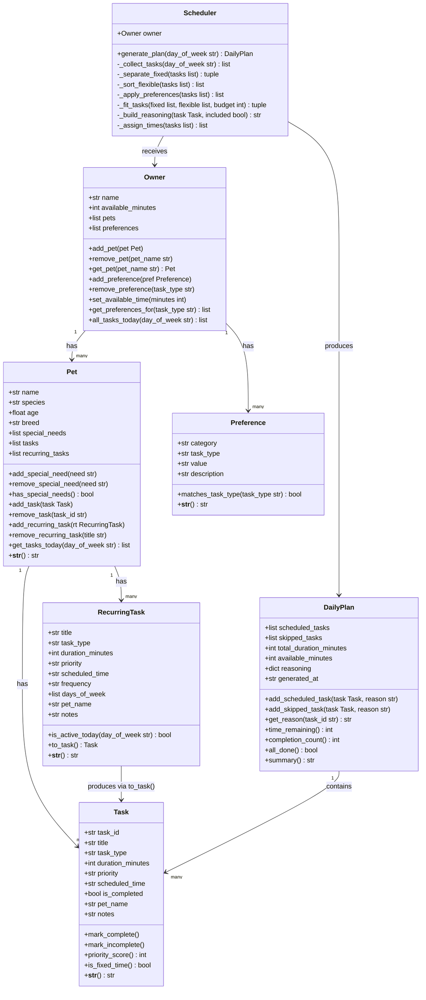

# PawPal+ Project Reflection

## 1. System Design

**a. Initial design**

The system is designed around seven classes divided into three layers: data objects that hold state, a coordinator object that organizes them, and an engine that runs the scheduling logic.

- **Pet** — holds all information about one animal (name, species, age, breed, special needs) and owns that pet's task lists (one-off tasks and recurring task templates). Task management methods (`add_task`, `remove_task`, `get_tasks_today`) live here so that each pet is fully self-contained.
- **Task** — represents a single care action for today (walk, feeding, medication, grooming, appointment). It carries everything the scheduler needs: duration, priority, an optional fixed time, and a completion flag so the owner can check tasks off during the day.
- **RecurringTask** — a reusable template for tasks that repeat daily or weekly (e.g., daily 7 AM feeding). It never gets checked off itself; instead it generates a fresh Task instance each day via `to_task()`, keeping the template clean.
- **Preference** — encodes one scheduling constraint from the owner (e.g., "prefer walks in the morning", "medications at a fixed time"). Storing these as objects rather than strings lets the Scheduler query them by task type programmatically.
- **Owner** — manages a list of pets and the owner's preferences and available time. It no longer holds tasks directly; instead `all_tasks_today` iterates through all pets and collects their tasks in one place for the Scheduler.
- **DailyPlan** — the output artifact produced by the Scheduler. It stores the ordered list of tasks that fit in today's time budget, the tasks that were skipped, and a reasoning string for each task so the UI can explain the plan to the owner.
- **Scheduler** — the algorithmic engine. It takes an Owner, separates fixed-time tasks from flexible ones, sorts flexible tasks by priority, greedily fills the time budget, assigns suggested start times, and returns a DailyPlan. All business logic lives here so it can be tested independently of the UI.

**Core User Actions**

The core actions a user should be able to perform are:

1. **Add a pet** — The user can enter basic information about their pet (name, species, age, and any special needs). This gives the scheduler the context it needs to tailor task recommendations to that specific animal.

2. **Add and manage care tasks** — The user can create tasks such as morning walks, feedings, medication doses, grooming sessions, or vet appointments. Each task includes a title, estimated duration, and a priority level (low, medium, or high) so the scheduler knows what to fit in first.

3. **Set available time and preferences** — Before generating a plan, the user tells the app how much free time they have today (e.g., 90 minutes) and any personal preferences (e.g., prefer walks in the morning, medications must happen at a fixed time). This acts as the main constraint the scheduler works within.

4. **Generate and view the daily schedule** — The user can request a prioritized daily plan. The app orders tasks by priority and fits them within the available time window, then displays the schedule clearly along with a short explanation of why each task was included and when it should happen.

5. **Mark tasks as completed** — Throughout the day, the user can check off tasks as they finish them. This lets the app track what still needs to be done and could be used in future sessions to surface recurring tasks that are often skipped.

6. **Add a recurring appointment** — The user can schedule standing appointments (e.g., weekly vet checkup, daily 7 AM feeding) that automatically appear in the plan every day or on a set schedule, so the user does not have to re-enter them manually.

**UML Class Diagram**

**b. Design changes**

Two bottlenecks were found when reviewing the class skeleton before implementing any logic:

1. **`Task.task_id` was initialized to `None`.**
   In the original skeleton, `task_id` was a placeholder comment ("auto-generated in implementation"). The problem is that `Owner.remove_task`, `DailyPlan.get_reason`, and the `reasoning` dictionary all use `task_id` as a key. If every task has `task_id = None`, these lookups either silently overwrite each other or always fail to find the right task. The fix was to import `uuid` and generate a unique ID immediately in `Task.__init__` with `str(uuid.uuid4())`, so every Task has a guaranteed unique ID from the moment it is created.

2. **`DailyPlan.generated_at` was initialized to `None`.**
   The original comment said "set in implementation," but there is no separate method that sets it — it is only ever written once, when the plan is first created. Deferring it to "later" means it could easily be forgotten and stay `None` permanently. The fix was to set it immediately in `DailyPlan.__init__` using `datetime.now().strftime("%Y-%m-%d %H:%M")`, so the timestamp is always present as soon as a plan is instantiated.

3. **Tasks and recurring tasks moved from `Owner` to `Pet`.**
   The original UML placed `tasks` and `recurring_tasks` as lists on `Owner`, with `Owner` responsible for adding, removing, and serving them. During implementation it became clear that a task always belongs to a specific pet — a walk is Mochi's walk, a medication is Bella's medication. Keeping tasks on Owner meant the pet association was only tracked through a `pet_name` string field, with no structural enforcement. Moving the lists to Pet makes each pet fully self-contained: `pet.add_task()`, `pet.remove_task()`, and `pet.get_tasks_today()` all live where the data lives. Owner's `all_tasks_today` now simply iterates through its pets and collects their tasks, which is a cleaner separation of responsibility.

---

## 2. Scheduling Logic and Tradeoffs

**a. Constraints and priorities**

- What constraints does your scheduler consider (for example: time, priority, preferences)?
- How did you decide which constraints mattered most?

**b. Tradeoffs**

The scheduler uses a **greedy first-fit algorithm**: it sorts tasks by priority and then adds each one to the plan if it fits in the remaining time budget, moving on immediately if it does not. It never backtracks or tries a different combination.

This creates a real tradeoff. Suppose 35 minutes remain in the budget and the next task (high priority) needs 40 minutes — it gets skipped. But two lower-priority tasks totaling 30 minutes could have filled that gap productively. The greedy approach misses this because it never looks ahead or reconsiders a rejected task.

The alternative — trying every possible combination of tasks to find the best fit — is a version of the **0/1 knapsack problem**, which is NP-hard. A brute-force solution checking all combinations would be exponentially slower as the number of tasks grows.

This tradeoff is reasonable for a pet care app for two reasons. First, a typical owner has at most 8–12 tasks per day, so the greedy result is close to optimal in practice — there are rarely enough tasks to expose the gap. Second, predictability matters more than perfection here: the owner can read the "Skipped" list and understand exactly why each task was dropped (not enough time, in priority order), which is more useful than an opaque optimal solution that is hard to explain.

---

## 3. AI Collaboration

**a. How you used AI**

- How did you use AI tools during this project (for example: design brainstorming, debugging, refactoring)?
- What kinds of prompts or questions were most helpful?

**b. Judgment and verification**

- Describe one moment where you did not accept an AI suggestion as-is.
- How did you evaluate or verify what the AI suggested?

---

## 4. Testing and Verification

**a. What you tested**

- What behaviors did you test?
- Why were these tests important?

**b. Confidence**

- How confident are you that your scheduler works correctly?
- What edge cases would you test next if you had more time?

---

## 5. Reflection

**a. What went well**

- What part of this project are you most satisfied with?

**b. What you would improve**

- If you had another iteration, what would you improve or redesign?

**c. Key takeaway**

- What is one important thing you learned about designing systems or working with AI on this project?
